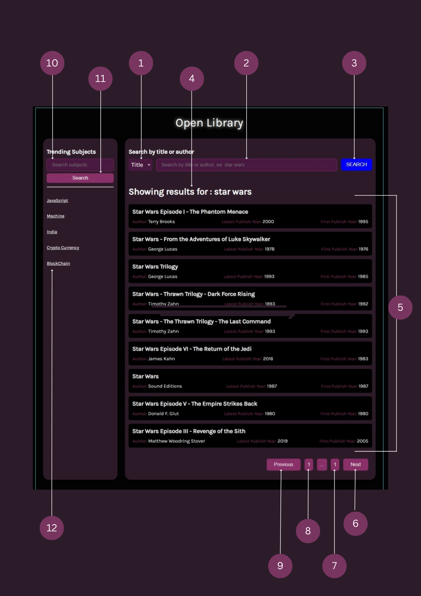

# Fyle Internship Assignment - Prajesh Gawhale


## Getting Started

1. Clone the repository.
```sh
  git clone https://github.com/prajesh9921/Fyle_Internship_Assignment_Prajesh_Gawhale.git
```
2. After cloning save the project and open terminal inside the project folder and run the command below to start the project.
```sh
  npm run start
```
3. It will start your project on localhost:3000. Open project on any browser.

## Documentation
Please refer the below image to understand the functionalities.



### Note: When the app loads for the 1'st time it will show you 10 results for "star wars" by default. The next button will not work as only the 10 results are fetched.
<br>
Refer below table to understand the points.

| Point No. | Working | by `default` |
| --- | --- | --- |
| 1 | This is a drop down button. You can search the book by *title* or *author* by selecting the parameter `title` or `author` from dropdown mwnu  |  `title` |
| 2 | This is a search bar. You can enter your text to search for the books | - |
| 3 | Search Button. After pressing the button the api will be called to fetch the result for your query | - |
| 4 | This is a indicator to show for what query the results are showned. It will show star wars when the app loads for the 1st time | "star wars". |
| 5 | This is the section where the results of your query are shown. Only 10 results are displayed at a time. | Shows only 1'st 10 result for "star wars" | 
| 6 | Next button to go to the next page to view next 10 results for your query | - |
| 7 | Shows the total number of pages. | `1` |
| 8 | Shows the current page you are on. | `1` |
| 9 | Previous button to go back 1 page | `1` |
| 10 | Search bar for searching the books on a subject. Enter the subjects you want books about and it will fetch you a list of books. | - |
| 11 | Search Button. After you enter the subject in search bar above press the search button it will make an api call to fetch the result. | - |
| 12 | It is a predefined subject. Click on it to get the books on that subject. It will fetch result for block chain. Above there are 4 more subjects which are also predefined and they will also fetch the result for their subject.| `blockchain` |
